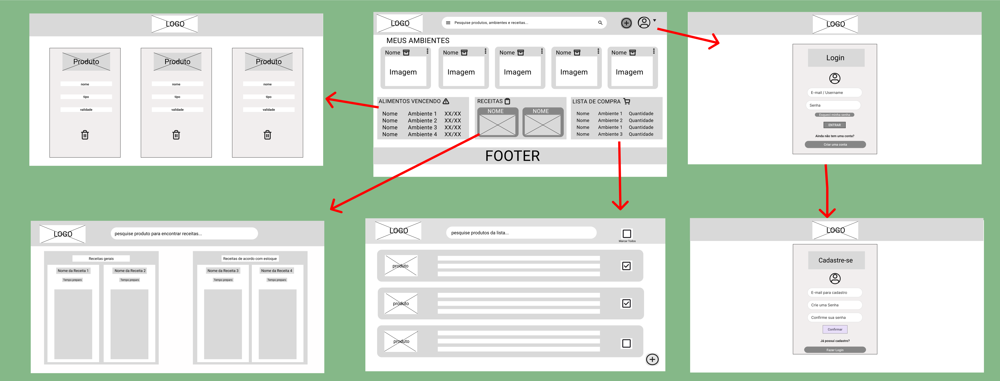
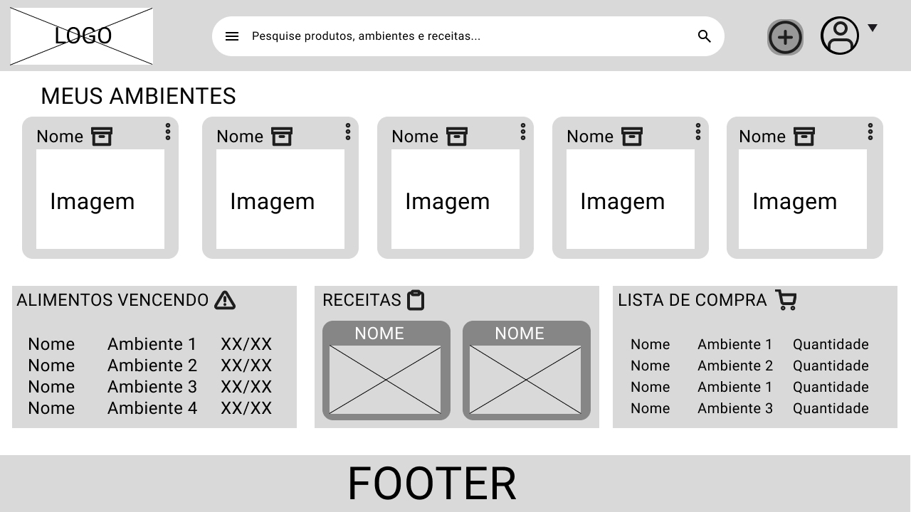
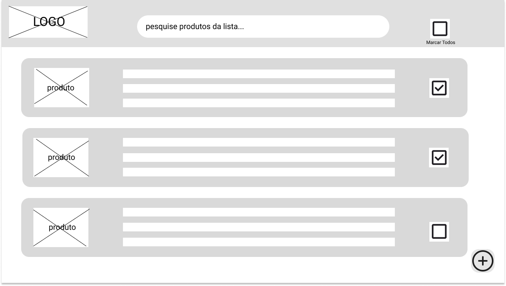
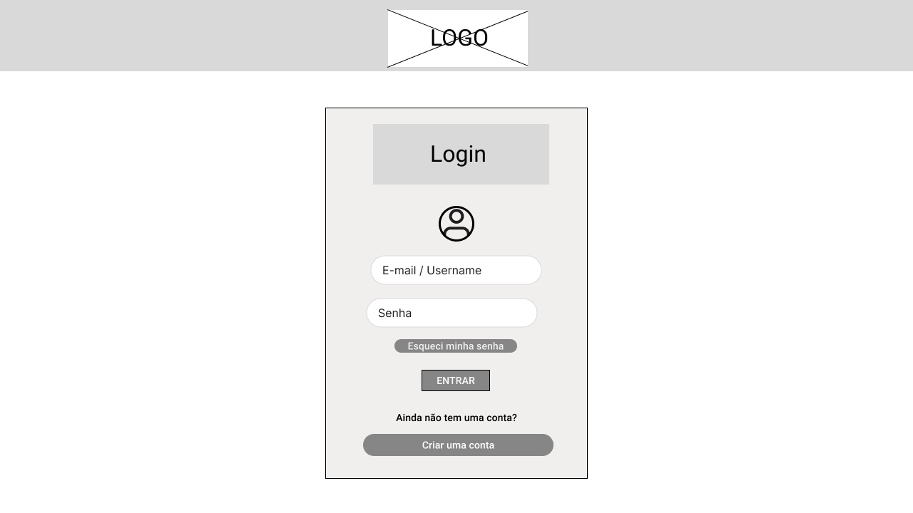
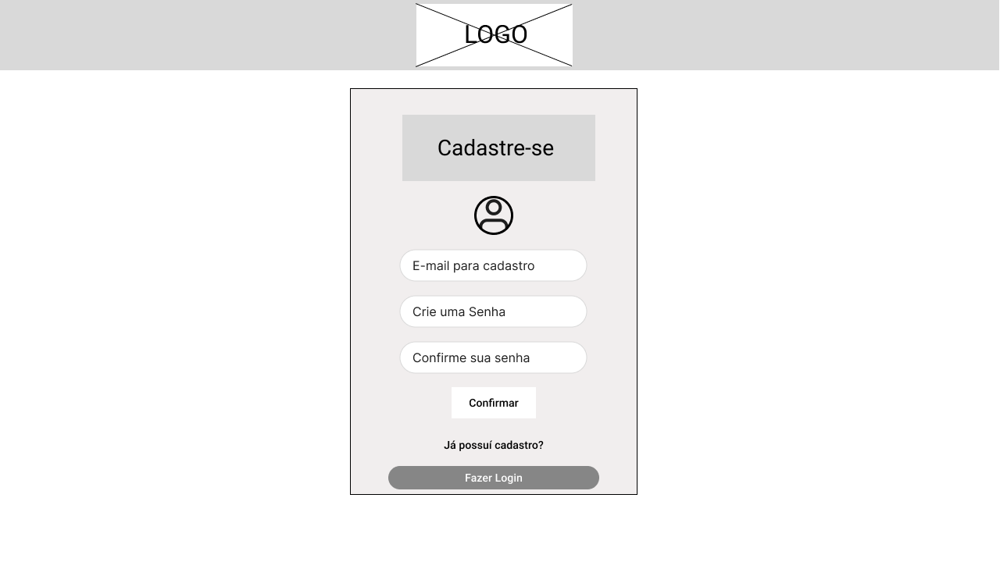
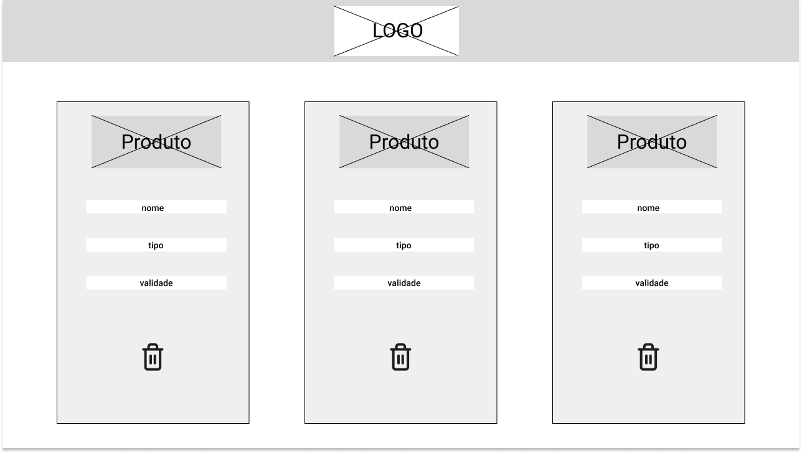

# 📁 Documentação Auxiliar – Files

Esta pasta contém artefatos essenciais utilizados no desenvolvimento do **StockIT**, organizados e nomeados de forma clara para fácil navegação.  
Todos os arquivos estão no diretório **`assets/`**.

---

## 🧠 1. Design Thinking & Discovery

### 🔍 Matriz CSD  
📄 **Acessar documento:**  
👉 [Matriz CSD](assets/matrizCSD.pdf)

---

### 👥 Mapa de Stakeholders

📄 **Acessar PDF:**  
👉 [Mapa de Stakeholders](assets/mapa.pdf)

---

### 🧩 Processo de Design Thinking  
📄 **Acessar documento:**  
👉 [Processo de Design Thinking](assets/processo-dt.pdf)

---

### ⭐ Highlights da Pesquisa  
📄 **Acessar documento:**  
👉 [Highlights da Pesquisa](assets/highlight.pdf)

---

## 🎤 2. Entrevistas Qualitativas

📄 **Entrevistas completas:**

- [Entrevista – Bar](assets/entrevista-qualitativa-bar.pdf)
- [Entrevista – Cafeteria](assets/entrevista-qualitativa-cafeteria.pdf)
- [Entrevista – Cozinheiro](assets/entrevista-qualitativa-cozinheiro.pdf)
- [Entrevista – Dona de Casa](assets/entrevista-qualitativa-dona.pdf)
- [Entrevista – Enfermeira](assets/entrevista-qualitativa-enfermeira.pdf)
- [Entrevista – Sócia de Restaurante](assets/entrevista-qualitativa-socia.pdf)

---

## 👤 3. Personas

📄 **Personas disponíveis:**

- [Cliente – Pessoa](assets/cliente-pessoa.pdf)
- [Cliente – Empresa](assets/cliente-empresa.pdf)
- [Usuário – Empresa](assets/usuario-empresa.pdf)
- [Usuário – Pessoa](assets/usuario-pessoa.pdf)

---

## 🔄 4. Fluxo de Telas da Aplicação (Wireframes)

---

## 🖼️ 5. Telas da Aplicação (Versão Web)

### 🏠 Home

---

### 🛒 Lista de Compras

---

### 🔐 Login

---

### 🧾 Cadastro

---

### 🧃 Alimentos

---

## 📄 6. Documento Consolidado
Documento geral com artefatos completos de Design Thinking e Product Discovery:

👉 [Documentação](assets/document.pdf)

